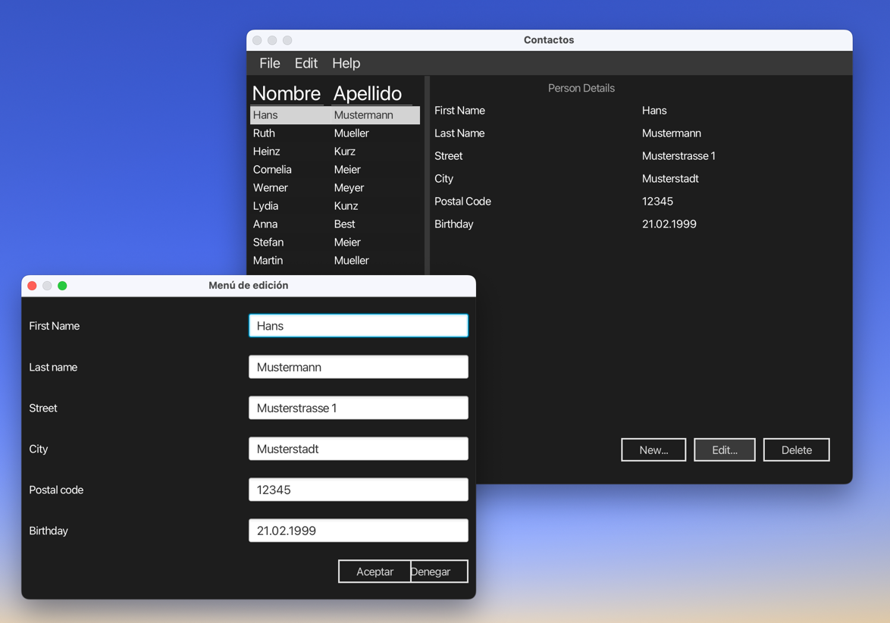
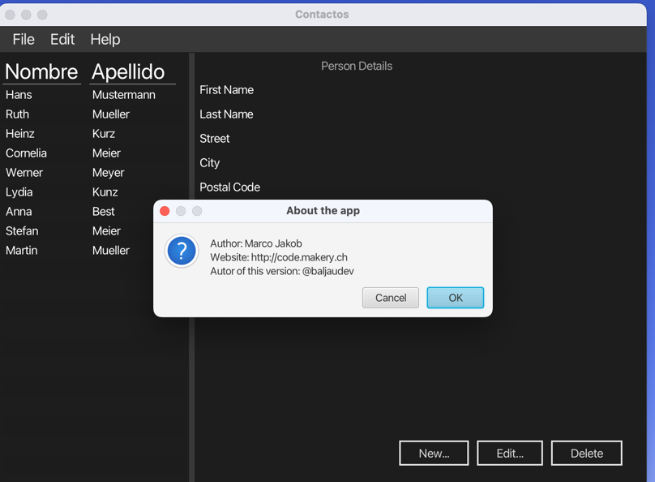

# AdressBook Project in JavaFX (v. 5.0)

This is a simple project to learn JavaFX. It is a simple address book with a few features. It is a simple project to learn JavaFX. It is a simple address book with a few features.

## Information
- Author: Alex Gheorghe
- Date: 2022-11-17
- Version: 5.0
- Course: JavaFX (Universidad Europea de Madrid)
## Proofs

